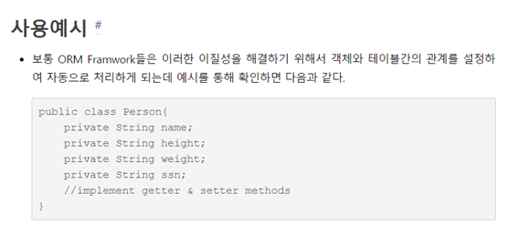
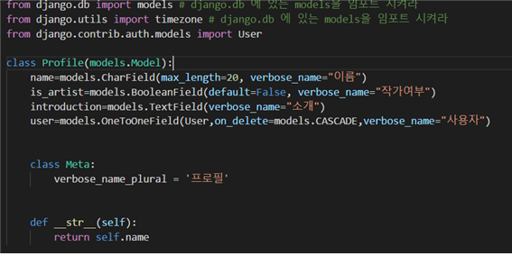
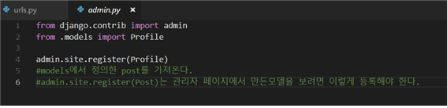

# Model

 

### ORM 서비스란??

ORM(Object-relational mapping)을 단순하게 표현하면 객체와 관계와의 설정이라 할 수 있다. ORM에서 말하는 객체(Object)의 의미는 우리가 흔히 알고 있는 OOP(Object_Oriented Programming)의 그 객체를 의미한다는 것을 쉽게 유추할 수 있을 것이다. 그렇다면 과연 관계라는 것이 의미하는 것은 무엇일까? 지극히 기초적인 이야기지만 개발자가 흔히 사용하고 있는 관계형 데이터베이스를 의미한다.

META CLASS 란??

### 모델 정의하는 과정

필요한 부분을 모델에 넣고 들어가 에트리뷰트를 지정해준다.(마지막 줄 같은 사용자는 User가 들어가기 때문에 User를 import 시켜준다.) 그리고 Meta는 그 admin에 테이블 이름을 보여주고 str은 만약 shell을 썼을 때 가장 먼저 첫 튜플에 name을 보여준다.

그다음 admin에서 그 테이블을 보여주려면 설정을 해준다.
