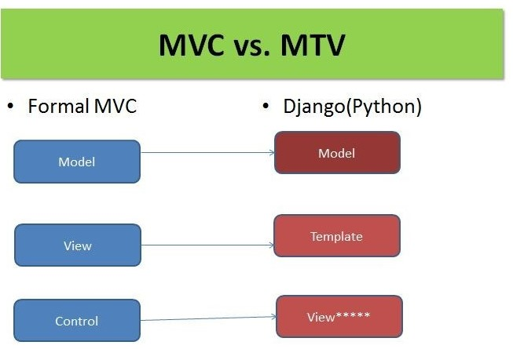
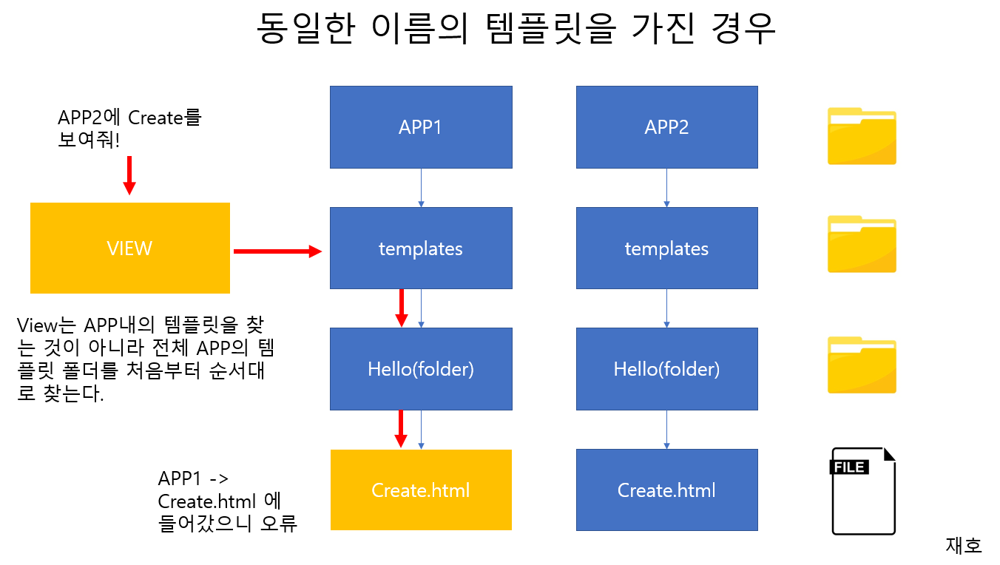
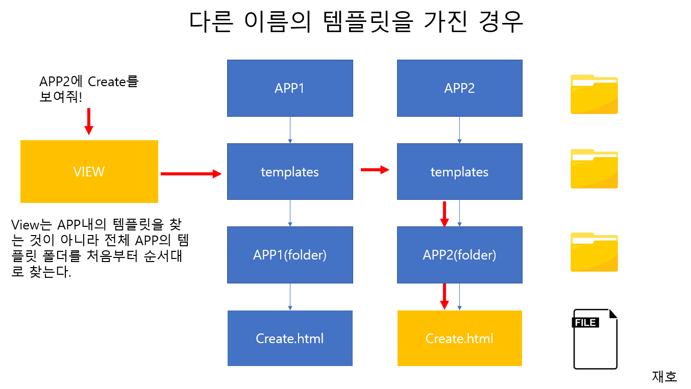
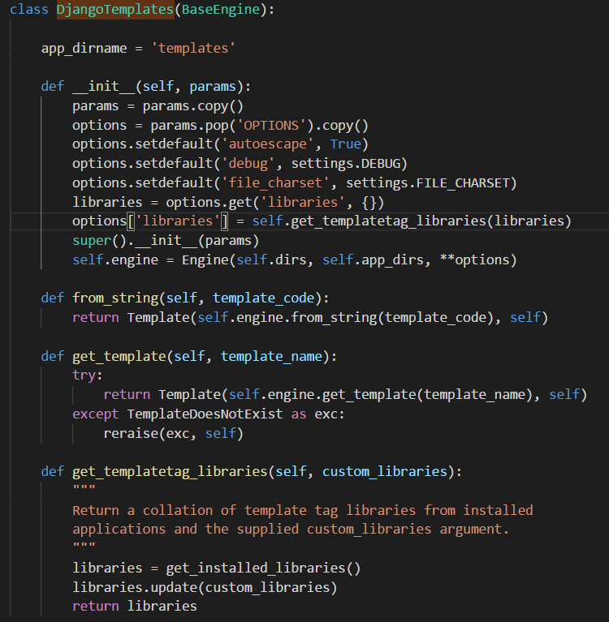
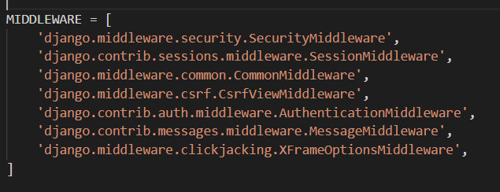

# Template

 

### 목차

* 1) Template 이란?
* 2) Template setting
* 3) Template Language  
* 4) Bootstrap, CSS, HTML, Form, CSRF (Cross-Site Request Forgery)
  
 

### 1) Template 이란?

template에 대해서 설명하기전 간략하게 MTV패턴에 대해서 설명하고 Template에 대해서 설명해드리겠습니다. 웹 개발 시 일반적으로 언급되는 MVC패턴이란 데이터(M),사용자 인터페이스(V),데이터를 처리하는 로직(C)로 구분해서 한요소가 다른 요소들에게 영향을 주지 않도록 설계하는 방식입니다. 장고 프레임워크에서는 View와 비슷한 역할을 한다. **템플릿(Template)은 View로부터 전달된 데이터를 템플릿에 적용하여 Dynamic 한 웹페이지를 만드는데 사용된다.**

 

Template은 HTML 파일로서 Django App 폴더 밑에 "templates" 라는 서브폴더를 만들고 그 안에 템플릿 파일(*.html)을 생성한다. 이는 단일 App이거나 동일 템플릿명이 없는 경우 사용할 수 있다. 하지만, Django 개발 가이드라인은 "App폴더/templates/App명/템플릿파일" 처럼, 각 App 폴더 밑에 templates 서브폴더를 만들고 다시 그 안에 App명을 사용하여 서브폴더를 만든 후 템플릿 파일을 그 안에 넣기를 권장한다 (예: /home/templates/home/index.html ).

 

  

 

템플릿은 물론 순수하게 HTML로만 쓰여진 Static HTML 파일일 수는 있지만, 거의 대부분의 경우 View로부터 어떤 데이터를 전달받아 HTML 템플릿 안에 그 데이터를 동적으로 치환해서 사용한다. 예를 들어, 위의 index 뷰에서 message 라는 데이터를 index.html 이라는 템블릿에 전달하고 그 템플릿 안에서 이를 사용하기 위해서 다음과 같이 할 수 있다.

 1) 먼저 View (home/views.py)에서 다음과 같이 index()를 정의한다. 여기서 render는 django.shortcuts 패키지에 있는 함수로서 첫번째 파라미터로 request를, 그리고 두번째 파라미터로 템플릿을 받아들인다. 여기서 템플릿은 index.html으로 지정되어 있는데, 이는 home/templates/index.html을 가리키게 된다. 세번째 파라미터는 Optional 인데, View에서 템플릿에 전달한 데이터를 Dictionary로 전달한다. Dictionary의 Key는 템플릿에서 사용할 키(or 변수명)이고, Value는 전달하는 데이터의 내용을 담는다. 여기서는 message 라는 키로 "My Message"라는 문자열을 전달하고 있다.
~~~
from django.shortcuts import render
 
def index(request):
    msg = 'My Message'
    return render(request, 'index.html', {'message': msg})
~~~  

2) 다음으로 Template (home/templates/index.html)에 HTML 문서를 작성한다. 여기서 body 태그 안에 message를 보면 {{ }} 으로 둘러싸인 것을 볼 수 있는데, Django의 템플릿에서 {{ 변수명 }} 은 해당 변수의 값을 그 자리에 치환하라는 의미를 갖는다. Django Template은 또한 View로 부터 전달된 다양한 데이터들을 템플릿에 편리하게 넣을 수 있도록 여러 템플릿 태그(  와 같은 형태, 아래 참조)들을 제공하고 있다.
~~~
<!DOCTYPE html>
<html lang="en">
<head>
    <meta charset="UTF-8">
    <title>Title</title>
</head>
<body>
    <h1>{{message}}</h1>
</body>
</html>
~~~

 

### 2) Template setting

Django에서는 여러 템플릿 엔진을 선택하여 사용할 수 있으며, 이 셋팅은 Django 프로젝트의 settings.py 에서 할 수 있다. 디폴트 Django 템플릿 엔진을 사용하기 위해서는 settings.py 파일의 TEMPLATES 섹션에서 BACKEND를 django.template.backends.django.DjangoTemplates 로 설정한다 (기본으로 설정되어 있다).

 

### 3) Template Language 

Django 템플릿에서 사용하는 특별한 태그 및 문법을 Django 템플릿 언어 (Django Template Language)라 부른다. 템플릿 언어는 크게 템플릿 변수, 템플릿 태그, 템플릿 필터, 코멘트 등으로 나눌 수 있다.

   - 템플릿 변수
   - 템플릿 태그
   - 템플릿 필터
   - 코멘트
   - HTML Escape
 

**템플릿 변수**

템플릿 변수는 {{ 와 }} 으로 둘러 싸여 있는 변수로서 그 변수의 값이 해당 위치에 치환된다. 변수에는 Primitive 데이터를 갖는 변수 혹은 객체의 속성 등을 넣을 수 있다.

~~~
<h4>
  Name : {{ name }}
  Type : {{ vip.key }}
</h4>
~~~

**템플릿 태그**

템플릿 태그는  으로 둘러 싸여 있는데, 이 태그 안에는 if, for 루프 같은 Flow Control 문장에서부터 웹 컨트롤 처럼 내부 처리 결과를 직접 덤프하는 등등 여러 용도로 쓰일 수 있다. 다양한 태그에 대한 자세한 설명은 Built-in Template Tag 를 참조하면 된다. 아래 처음 부분은 if 와 for 태그를 사용한 예이고, 마지막은 CSRF 해킹 공격에 대응하여 토큰을 넣어주는 csrf_token 태그를 사용한 예이다.
~~~

    Data Count = {{ count }}

    No Data

 

  <li>{{ item.name }}</li>

 

~~~

 

**템플릿 필터**

템플릿 필터는 변수의 값을 특정한 포맷으로 변형하는 기능을 한다. 예를 들어, 날짜를 특정 날짜 포맷으로 변경하거나 문자열을 대소문자로 변경하는 일등등..을 할 수 있다.
~~~
날짜 포맷 지정
{{ createDate|date:"Y-m-d" }}
 
소문자로 변경
{{ lastName|lower }}
~~~

 

**코멘트**

템플릿에서 코멘트를 넣는 방법은 크게 2가지이다. 한 라인에 코멘트를 적용할 때는 코멘트를 {# 과 #} 으로 둘러싸면 된다. 또한, 복수 라인 문장을 코멘트할 경우는 문장들을  태그와 로 둘러싸면 된다.

~~~
{# 1 라인 코멘트 #}
 
  
  

      

          불필요한 블럭
      

      
  


~~~

 

**HTML Escape**

HTML 내용 중에 <, >, ', ", & 등과 같은 문자들이 있을 경우 이를 그 문자에 상응하는 HTML Entity로 변환해 주어야 하는데, Django 템플릿에서 이러한 작업을 자동으로 처리해 주기 위해  템플릿 태그나 escape 라는 필터를 사용한다.

예를 들어, 아래 예제에서 content 라는 변수에 인용부호가 들어 있다고 했을 때, 아래와 같이 autoescape 태그나 escape 필터를 사용해서 자동으로 변환하게 할 수 있다. 만약 이러한 변환을 하지 않으면 HTML이 중간에 깨지게 된다.
~~~
     # autoescape 태그
    {{ content }}

 
{{ content|escape }}    # escape 필터
~~~
만약 이러한 HTML escape 혹은 HTML 인코딩 기능을 사용하지 않고, <, >, ', ", & 이 들어간 문자열을 HTML에서 사용하고자 한다면, 각 문자를 HTML Entity로 미리 변환해 주어야 한다. 이러한 변환을 보다 편리하게 하는 한 방법으로 온라인 [HTML 인코딩 변환 도구](http://htmlencode.online/)를 사용할 수 있다.

 
### 4) Bootstrap, CSS, HTML, Form, CSRF (Cross-Site Request Forgery)

CSRF란 사이트 간 요청 위조(Cross-Site Request Forgery)라는 웹사이트 취약점 공격 중에 하나를 뜻한다. 사용자가 자신의 의지와는 무관하게 공격자가 의도한 행위(수정,삭제,등록 등)을 특정 웹사이트에 요청하게 하는 공격을 말한다. 장고는 1.2버전부터 이러한 CSRF 취약점을 막는 기능인 CSRF 토큰방식을 기본으로 제공한다. 모든 POST 방식의 폼 전송에는 hidden 필드로 세션에 따른 임의 키값을 전송하며, 해당 키 값이 유효한지를 매번 확인한다.

###사용방법
1. 첫째로, setting.py의 미들웨어에 아래와 같이 추가한다.
>현재 우리는 기본적으로 추가되어 있다.

2. 두번쨰로, from 태그가 있는 템플릿에 을 입력해야 한다.  
   
~~~
<form method="post" action=".">

{{form.as_p}}
<input type="submit" value="저장" />
</form>
~~~

특정 뷰에는 적용하고 싶지 않다면 csrf_exampt 장식자를 사용한다.

~~~
from django.views.decorators.csrf import csrf_exampt

@csrf_exampt
def view_function(request):
    return HttpResponse('~~~')
~~~

 