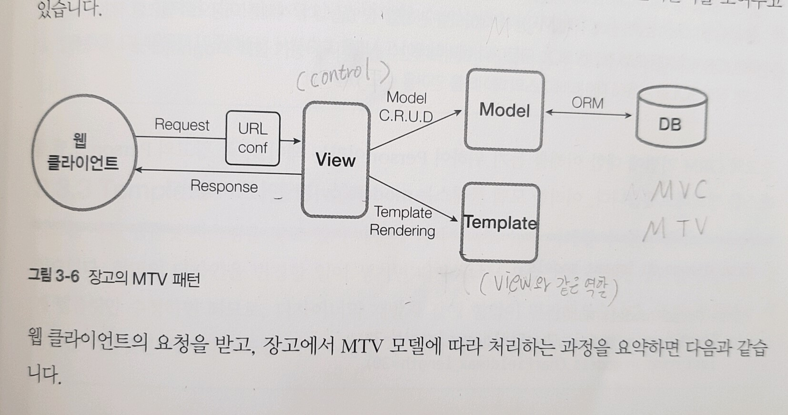

# View

 
###목차  

   - Django View
   - Render
   - Redirect
   - Url Reverse

  ### 1) Django View

Django에서의 뷰(View)는 다른 일반 MVC Framework에서 말하는 Controller와 비슷한 역할을 한다 (정확히 같은 개념은 아님. 아래 MTV 패턴 참조). 즉, View는 필요한 데이터를 모델 (혹은 외부)에서 가져와서 적절히 가공하여 웹 페이지 결과를 만들도록 컨트롤하는 역할을 한다.

View들은 Django App 안의 views.py 라는 파일에 정의하게 되는데, 각 함수가 하나의 View를 정의한다. 각 View는 HTTP Request를 입력 파라미터로 받아들이고, HTTP Response를 리턴한다.  

~~~
from django.http import HttpResponse
 
def index(request):
    return HttpResponse("<h1>Hello, World!</h1>")
~~~
위의 예제는 하나의 View 함수를 표현한 것인데, 이 함수는 입력으로 항상 request 를 받아들이고, response 를 리턴하게 된다. 여기서는 간단한 HTML Text를 포함한 HttpResponse() 객체를 리턴하고 있다. 일반적으로 Django 에서는 좀 더 복잡한 HTML을 처리하기 위해 뷰 템플릿(Template)을 사용한다.

Django는 Model, Template, View라는 MTV 패턴을 따르고 있는데, MTV은 MVC (Model View Controller)와 유사한 점이 많다. Django는 Controller의 역할을 Django Framework 자체에서 한다고 보고 있으며, 따라서 MVC와 약간 다른 미묘한 차이를 MTV로 설명하고 있다.

MTV에서의 Model은 데이터를 표현하는데 사용되며, 하나의 모델 클래스는 DB에서 하나의 테이블로 표현된다. MTV의 View는 HTTP Request를 받아 그 결과인 HTTP Response를 리턴하는 컴포넌트로서, Model로부터 데이터를 읽거나 저장할 수 있으며, Template을 호출하여 데이터를 UI 상에 표현하도록 할 수 있다. MTV의 Template은 Presentation Logic 만을 갖는데 HTML을 생성하는 것을 목적으로 하는 컴포넌트이다.  

 

  
 

Django에서는 뷰 부분을 함수형 뷰(Function Based View, FBV)와 클래스형 뷰(Class Based View, CBV)로 나뉘는데 그 중 함수형 뷰에 대해 살펴봅니다.

   - fbv 앱 추가
  ~~~
  python manage.py startapp fbv
  ~~~

  * settings.py 에 앱 등록합니다. 코드는 생략
  * 프로젝트명/urls.py에 아래 url을 추가합니다.
  
~~~
urlpatterns = [
    ... 생략
    
    path('fbv/', include('fbv.urls')),
]
~~~
   * fbv /urls.py 파일을 생성합니다.

### 1-2) HttpResponse

  

### 2) Render
render 함수는 request 객체를 첫번째 인자로, 템플릿 이름을 두번째 인자로 받습니다. 그리고 세번째 인자는 선택적으로써, 템플릿에 전달할 딕셔너리입니다. render() 함수는 주어진 템플릿과 딕셔너리로 렌더링된 결과를 HttpResponse 객체로 리턴합니다.

