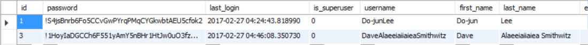

# Social Login

   

  ### 목차
  1) social - auth-app-Django 설치
  2) setting.py 설정
  3) 웹 어플리케이션 urls.py 추가(login, logout)
  4) view 함수 만들기
  5) templates 에서 띄울 파일 만들기
  6) developers.facebook에서 local address 추가

### 1)Social -auth - app - django Setup

  social-auth-app-django 설치하기

 ~~~
 pip install social-auth-app-Django
 ~~~

### 2)setting.py 설정

~~~
...

INSTALLED_APPS = [
    'django.contrib.admin',
    'django.contrib.auth',
    'django.contrib.contenttypes',
    'django.contrib.sessions',
    'django.contrib.messages',
    'django.contrib.staticfiles',
    # social-auth-app-django
    'social_django',
    'Gamers',
]

...

# social-auth-app-django
AUTHENTICATION_BACKENDS = (
    # 'social_core.backends.open_id.OpenIdAuth',
    # 'social_core.backends.google.GoogleOpenId',
    # 'social_core.backends.google.GoogleOAuth2',
    # 'social_core.backends.google.GoogleOAuth',
    # 'social_core.backends.twitter.TwitterOAuth',
    # 'social_core.backends.yahoo.YahooOpenId',
    'social_core.backends.facebook.FacebookOAuth2',
    'django.contrib.auth.backends.ModelBackend',
)

...

# Facebook
SOCIAL_AUTH_FACEBOOK_KEY = '앱ID'
SOCIAL_AUTH_FACEBOOK_SECRET = '시크릿코드'
SOCIAL_AUTH_FACEBOOK_SCOPE = ['email']
SOCAIL_AUTH_FACEBOOK_PROFILE_EXTRA_PARAMS = {
    'fields': 'id, name'
}

...
~~~
   - INSTALLED_APP에 social_django 추가
   - AUTHENTICATION_BACKENDS에 social_core.backends.facebook.FacebookOAuth2 추가
   - FACEBOOK에 관련된 정보들 추가
  

  ### 3) 웹 어플리케이션 urls.py 추가(login, logout)

  ~~~
  from django.conf.urls import url, include
from django.contrib.auth import views as auth_views
from . import views

urlpatterns = [
    url(r'^$', views.test),
    # logout
    url(r'^logout/$', auth_views.logout, name='logout', kwargs={'next_page': '/'}),
    # login
    url(r'', include('social_django.urls', namespace='social')),
]
  ~~~
로그인과 로그아웃 부분을 추가하였습니다.

### 4) view 함수 만들기

~~~
def test(request):
    return render(request, 'Gamers/test.html')
~~~

### 5) templates 에서 띄울 파일 만들기

~~~
<!DOCTYPE html>
<html>
<head>
</head>
<body>
{{user}} 
<a href="">Facebook</a>
<a href="">Logout</a>
</body>
</html>
~~~

### 6) developers.facebook에서 local address 추가

Facebook 앱에 들어가서 유효한 리디렉션에 로컬주소 입력  

> developers.facebook 앱 설정방법
>   
><https://m.blog.naver.com/PostView.nhn?blogId=chan2rrj&logNo=220958859734&proxyReferer=https%3A%2F%2Fwww.google.com%2F>

   

로그인을 하면 제가 유저 모델을 굳이 만들지 않아도 자동으로 Django의 기본 auth_user table에 사용자 정보가 저장됩니다.

